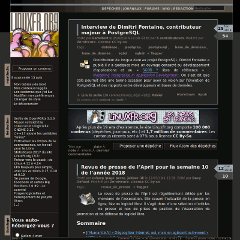
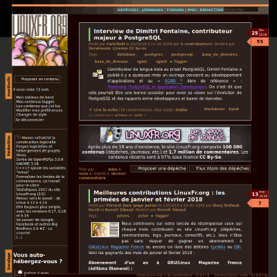
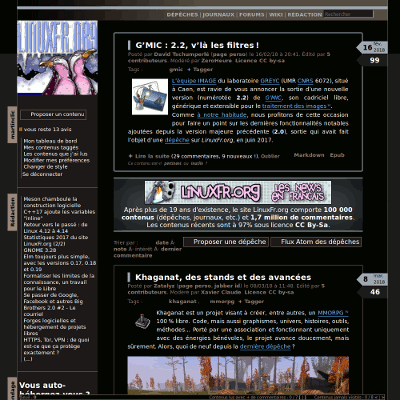
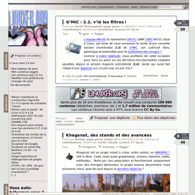

dlfp-themes: some CSS themes for linuxfr.org, especially dark
=============================================================

Variations of the default theme used by linuxfr.fr

CSS compilations
----------------

You need [Sass](https://sass-lang.com/)

to compile all css in the public dir:

    sh build.sh

to compile a particular css:

    sass src/darky-app.scss public/darky.css
or

    sass --style compressed src/darky-app.scss public/darky.min.css

other example:

    sass src/original-app.scss public/original.css
or

    sass --style compressed src/original-app.scss public/original.min.css

Create a new theme
------------------

To create a new theme named `foo`, create the files `foo-app.scss` and
`foo-colors.scss` in the `src` directory. The easiest way is to start from an
copy of existing files.

`foo-app.scss` contains inclusions of other parts.
Depending on whether your theme is light or dark, you can choose to include
`statistics.scss` or `statistics-darky.scss`. Similarly you can choose between
several variants for pygments (code highlighting in articles).

`foo-colors.scss` contains all colors variables used by other files. Despite its
name, it contains some path variables too. If your theme is dark, you probably
want to use the icons from the `icones-afafb1` and `markitup-dark` directories.
If your theme is light, the original `icones` and `markitup` directories seems
more appropriate. If you want to create your own variation of the original
`icones` dir, see the next section, there's a tool to help you.

Finally, you can add the name of your theme to the list in `build.sh` if you 
want to use it to compile it. Or you can simply generate it with Sass.

Create a new set of colored icons
---------------------------------

To create a new set of icons with another color than the original `#4E4E50`
color, for example `#0000ff`:

    sh create-icons.sh 0000ff

This will create (and erase an eventual existing one) the folder 
public/images/icones-0000ff, copy inside all the content of public/images/icones 
then change the color of the concerned svg files, and create and optimize their 
respective relative png file.

To create the png, [svgexport](https://github.com/shakiba/svgexport) or inkscape
must be installed. 
If [trimage](https://trimage.org/) is installed, it will be used to optimize the 
generated pngs.

Screenshots
-----------

darky  

chocolate  

dark-faithfull, same tints as original with inverted luminosity:  

original:  

Copyheart
---------

The code is licensed as GNU AGPLv3, like the
[sources of the linuxfr site](https://github.com/linuxfrorg/linuxfr.org).
See the LICENSE file for the full license.

♡2018 by Nicolas Martin. Copying is an act of love. Please copy and share.
